# Session 1 – Foundation: Fabric & Copilot (60 min)

### Demo of Copilot in Fabric
Follow along in your own environment or just watch.

1. Locate the Copilot icon on the left navigation rail and the one inside Lakehouse/Notebook experiences. Confirm they both exist. 
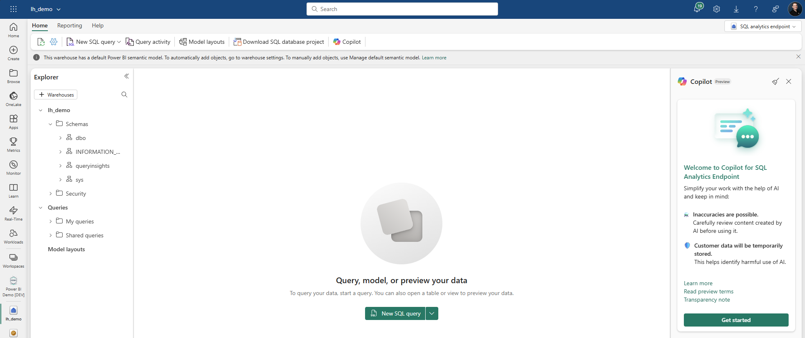

2. In Power BI Service, open any existing report and open the Copilot pane (“Ask data questions”) to see Copilot inside reports. 
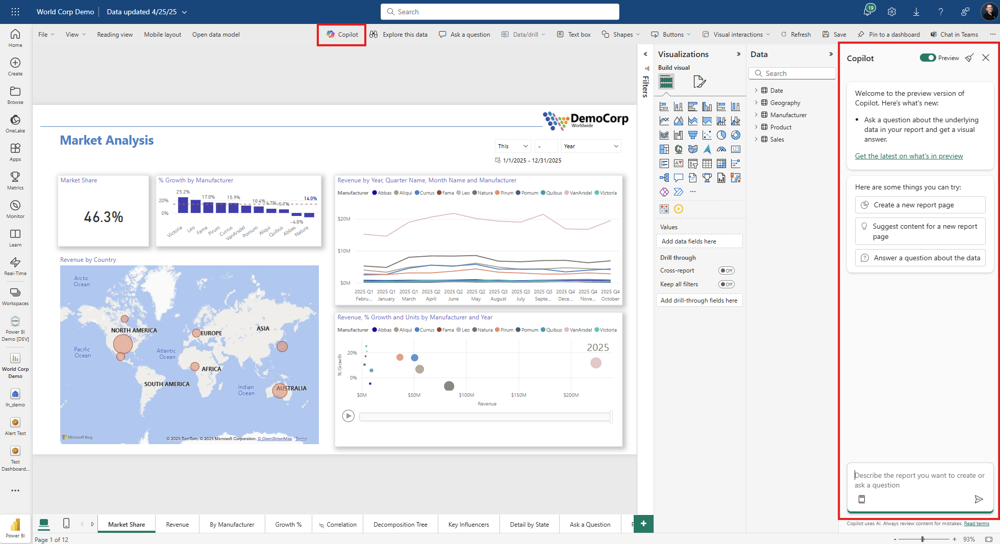

### Data Sourcing 
Create a Lakehouse, import data, and tranform with a Dataflow Gen2
 
1. Navigate to the workspace list and select the My Workspace.
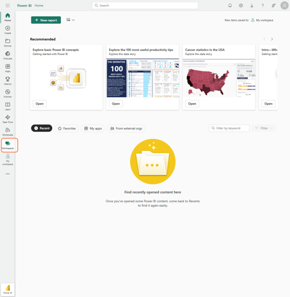

2. Create a Lakehouse:  New ► Lakehouse, name it **lh_demo**, then click **Create**. !
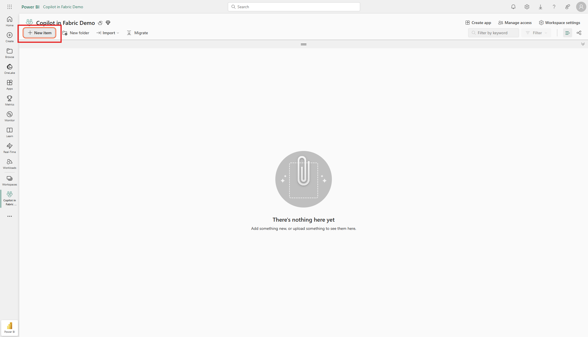

3. Search for **Lakehouse** and select the Lakehouse option

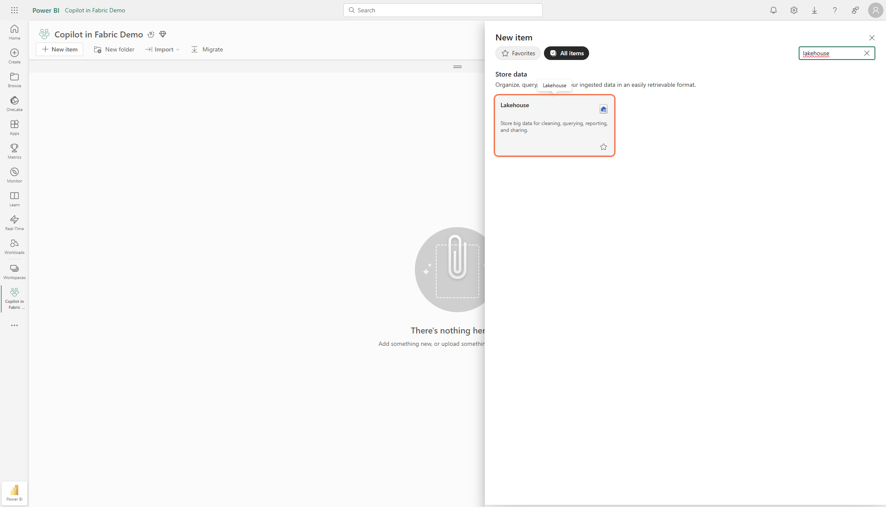

4. Name it **lh_demo**, then click **Create**. !
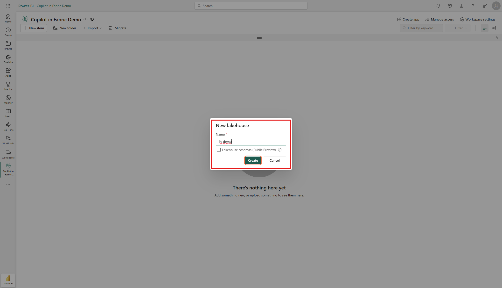

5. Upload the provided **Data** folder ([download](../downloads/Data.zip) here) into **/Files**. Right-click on the **/Files** folder in the Lakehouse and **Upload Folder**.
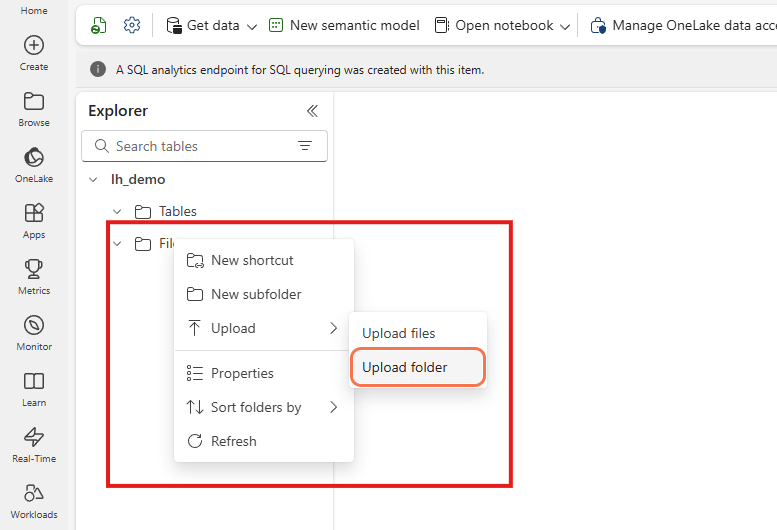

6. Select **Overwrite existing files** and then **Upload**.
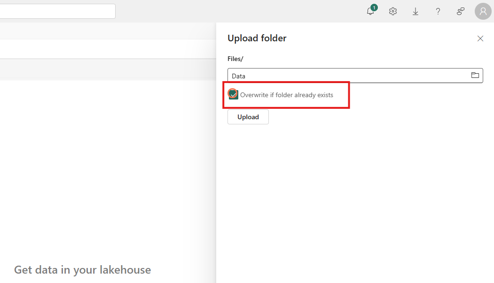
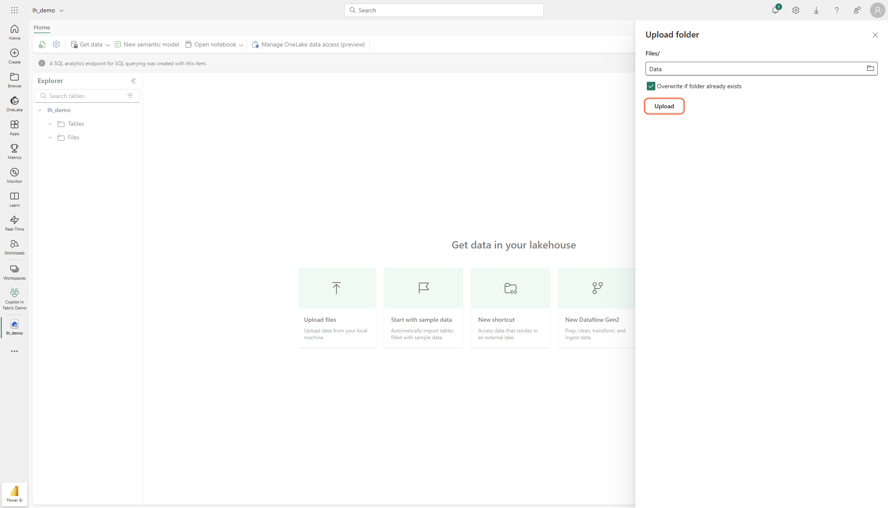

1. Create a Dataflow Gen2 that will transform the data into tables for our semantic model. Click **New Item** and search for **Dataflow**.

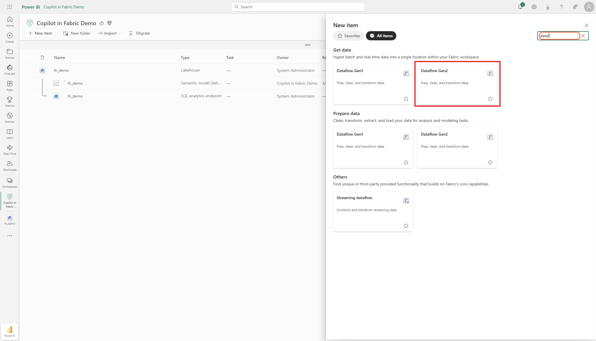
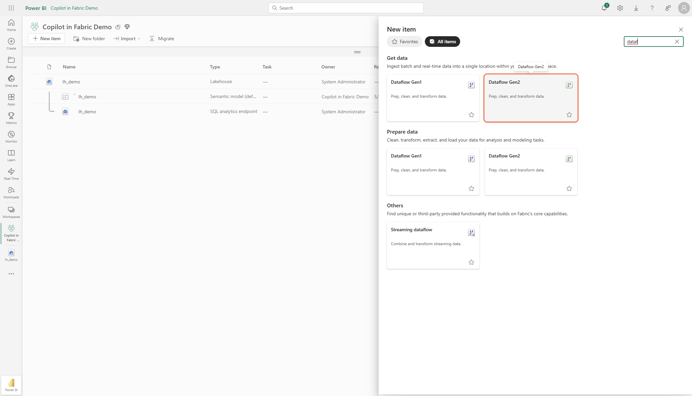

1. Import the **df_demo.pqt** file ([download](../downloads/df_demo.pqt) the template if needed)
2. Configure the Lakehouse Connection by clicking on the yellow button. Then sign in if needed, and click create.
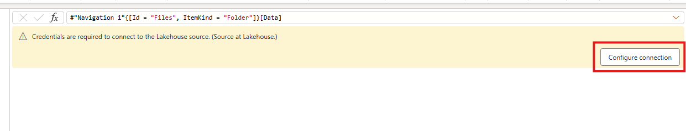

1.  Update the **Source Files** query by clicking on the gear icon next to the last Navigation step and selecting the **Files** folder in the Lakehouse you created earlier.
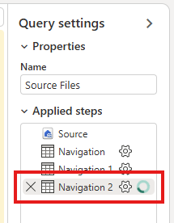
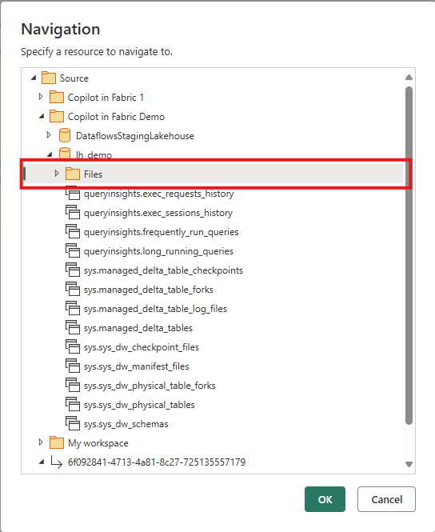

1.  Add a **Default Data Destination** and bind the tables you see in the screenshot below:
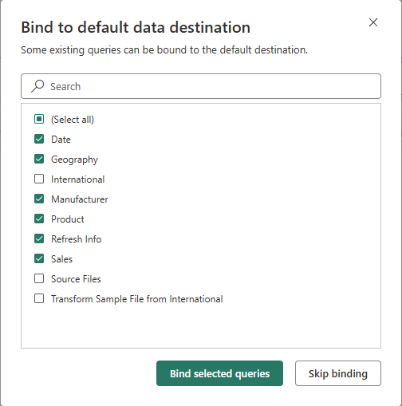
1.  Publish the dataflow.
2.  Generate a Semantic Model:  Lakehouse ► **New semantic model** ► select your tables ► **Create**.

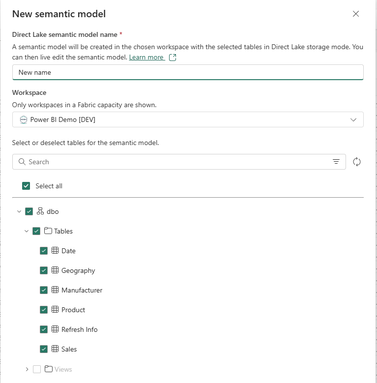

1.  Open **Model view**. Create 1‑many relationships to match the screenshot below:
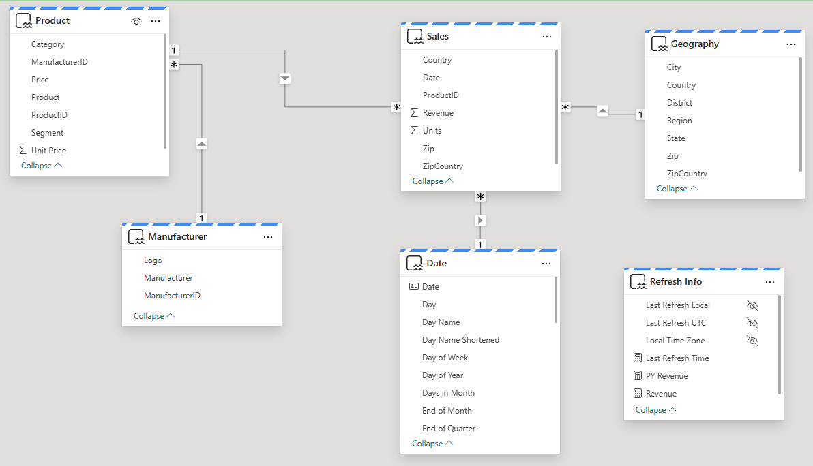

1.    Use Copilot to create a report with the prompt: "Create me a report to show sales over time including both high-level and detailed information."
  