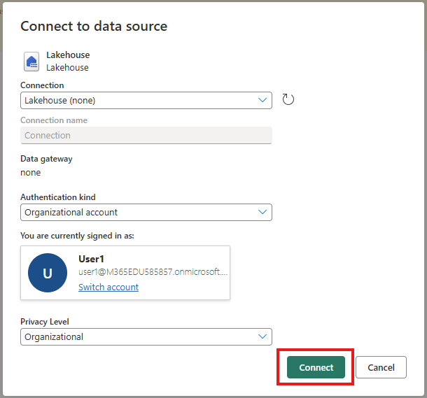
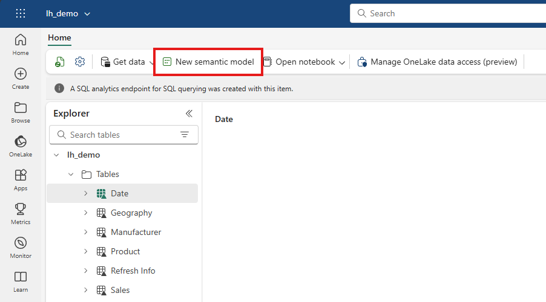

# Session 1 – Foundation: Fabric & Copilot (60 min)

## Session Overview

In this session, you will get hands-on experience with Microsoft Fabric and Copilot. You’ll create a Lakehouse, import data, transform it with Dataflow Gen2, and generate a semantic model for analytics.

---

## Step-by-Step Instructions

### Demo of Copilot in Fabric

Follow along in your own environment or just watch.

1. **Locate the Copilot icon** inside the Lakehouse SQL analytics endpoint experience. It will be in the top ribbon as pictured below.

    

2. **Open Copilot in the Power BI Service.**  
   Open any existing report and open the Copilot pane to see Copilot inside reports by clicking on the Copilot icon in the top ribbon as pictured below.

    

---

### Data Sourcing

Create a Lakehouse, import data, and transform it with a Dataflow Gen2.

3. **Navigate to the workspace list** and select **My Workspace** (You may also use a standard workspace as long as it is on Fabric or Premium Capacity).

    

4. **Create a Lakehouse:**  
   Click **New item** to open the artifact library.

    

5. **Search for "Lakehouse"** and select the Lakehouse option.

    

6. **Name it `lh_demo`** and click **Create**.

    

7. **Upload the provided Data folder**  
   [Download here](../downloads/Content.zip) and upload into **/Files**. Right-click on the **/Files** folder in the Lakehouse and select **Upload Folder**.

    

8. Click the folder icon and browse to select the data files you downloaded. **Select "Overwrite existing files"** and then click **Upload**.

    
    

9. **Create a Dataflow Gen2**  
   Click **New Item** and search for **Dataflow**.

    
    
    

10. **Import the `df_demo.pqt` file**  
    [Download the template](../downloads/df_demo.pqt) if needed.

    

11. **Configure the Lakehouse Connection**  
    Click the yellow button, sign in if needed, and click **Create**.

    
    

12. **Update the Source Files query**  
    Click the gear icon next to the last Navigation step and select the **Files** folder in the Lakehouse you created earlier.

    
    

13. **Add a Default Data Destination**  
    Bind the tables as shown in the screenshot below.

    

14. **Publish the dataflow.**

15. **Generate a Semantic Model**  
    In the Lakehouse, click **New semantic model**, select your tables, and click **Create**. Name the new model **direct lake demo**.

    
    

16. **Open Model view**  
    Create 1‑many relationships to match the screenshot below.

    

17. **Use Copilot to create a report**  
    Prompt:  
    `"Create me a report to show sales over time including both high-level and detailed information."`

    

---

## Reflection

- **Checkpoint:** Review your Lakehouse, Dataflow, and Semantic Model with your group.  
- **Discuss:** What worked well? Where did you encounter challenges?  
- **Prepare:** Bring your questions and findings to the next session.

---

**Tips for Success:**
- If you get stuck, ask your instructor or a classmate for help.
- Pause at checkpoints to review your progress.
- Share your screen if you need troubleshooting assistance.

---

Let your instructor know if you need further clarification or support!