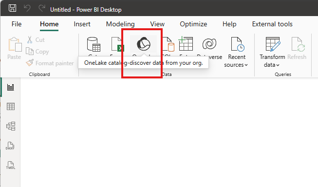
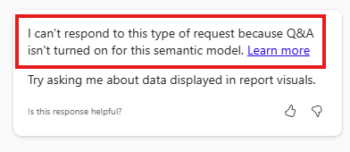
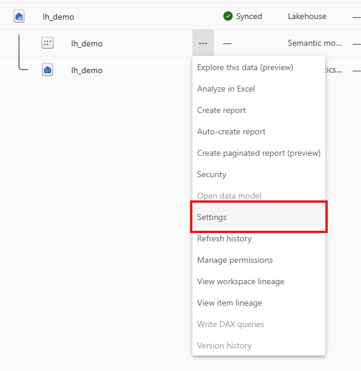
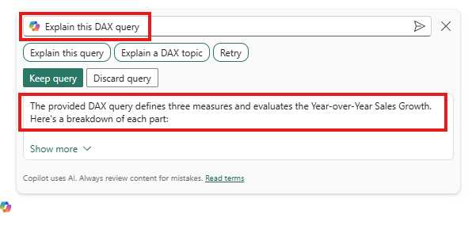

# Session 2 – Power BI & Copilot: The AI‑Enhanced Developer (60 min)

1. Launch Power BI Desktop. Sign in with the same tenant credentials.

2. Connect to the semantic model you just published: **OneLake catalog** ► select **lh_demo** (make sure it is the semantic model).

3. Open the Copilot pane: **Home ► Copilot**. Ensure the Copilot preview toggle is ON.

4. Prompt practice #1: in Copilot type **“Show total sales by product category.”**
5. You will likely get this error:

6. We need to turn on the Q&A settings on the semantic model. Open your browser, find the semantic model, then click the ellipsis and select settings.

7. Find Q&A and check the box **Turn on Q&A to ask natural language questions about your data** and select apply.

8. Now try the prompt again: **“Show total sales by product category.”**

 

9.  Generate DAX: prompt **“Create year‑over‑year sales growth measure.”** Then ask **“Explain this DAX.”** Notice that the result isn't helpful.

10. We need to use the DAX query view page in Power BI Desktop. It is the icon in the left menu, below the Model view. Click the Copilot icon and type: **“Create year‑over‑year sales growth measure.”** Then click the **“Explain this query”** button.

 

11.  Back on the Report view, create a full report page: prompt **“Create an executive dashboard showing total sales, profit %, and top 5 products.”** Let Copilot lay it out, then tweak titles or chart types manually. Your results may vary.

12.   Generate a narrative: prompt **“Summarize this page in three bullet points.”** Note if the summary makes sense. Your results may vary.

13.    Debrief: jot down what Copilot nailed and where it stumbled. Bring examples to the next lab where we will optimize the model further.
