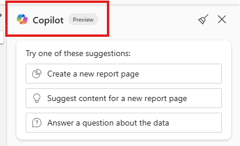
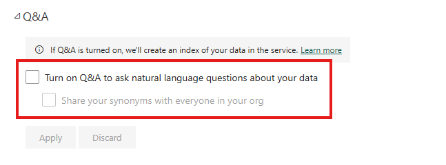

# Session 2 – Power BI & Copilot: The AI‑Enhanced Developer (60 min)

## Session Overview

In this session, you will connect Power BI Desktop to your semantic model, explore Copilot features, and practice using AI-powered analytics. By the end, you’ll be able to generate DAX, create dashboards, and summarize insights using Copilot.

---

## Step-by-Step Instructions

1. **Launch Power BI Desktop**  
   Sign in with your organizational credentials.

    
    

2. **Connect to the Semantic Model**  
   In Power BI Desktop, open the **OneLake catalog** and select **direct lake demo** (ensure it is the semantic model).

    
    

3. **Open the Copilot Pane**  
   Go to **Home ► Copilot**. Ensure the Copilot preview toggle is ON.

    

4. **Practice Prompt #1**  
   In Copilot, type:  
   `Show total sales by product category.`

5. **Troubleshoot Q&A Error**  
   If you receive an error, proceed to the next step.

    

6. **Enable Q&A Settings**  
   In your browser, find the semantic model, click the ellipsis (**...**) and select **Settings**.

    

7. **Turn On Q&A**  
   Find the Q&A section and check the box **Turn on Q&A to ask natural language questions about your data**. Click **Apply**.

    
    

8. **Retry the Prompt**  
   Try the prompt again:  
   `Show total sales by product category.`

    

9. **Generate DAX with Copilot**  
   Prompt:  
   `Create year-over-year sales growth measure.`  
   Then ask:  
   `Explain this DAX.`  
   *Note: The explanation may not always be helpful.*

    

10. **Use DAX Query View**  
    In Power BI Desktop, open the DAX Query View (icon below Model view). Click the Copilot icon and type:  
    `Create year-over-year sales growth measure.`  
    Then click **Explain this query**. Create the measures in your semantic model.

    
    

11. **Create a Dashboard with Copilot**  
    In Report view, prompt:  
    `Create an executive dashboard showing total sales, profit %, and top 5 products.`  
    Let Copilot lay out the report, then tweak titles or chart types as needed.  
    *Your results may vary.*

    

12. **Generate a Narrative**  
    Prompt:  
    `Summarize this page in three bullet points.`  
    *Note if the summary makes sense. Your results may vary.*

    

13. **Debrief and Reflect**  
    With your group, discuss:
    - What did Copilot do well?
    - Where did it struggle?
    - Bring examples to the next lab, where we will optimize the model further.

---

**Tips for Success:**
- If you get stuck, ask your instructor or a classmate for help.
- Pause at checkpoints to review your progress.
- Share your screen if you need troubleshooting assistance.

---

Let your instructor know if you need further clarification or support!
