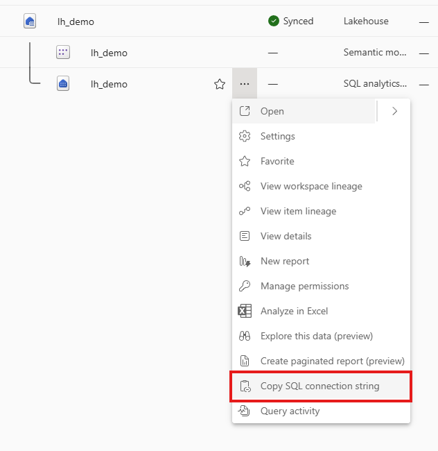
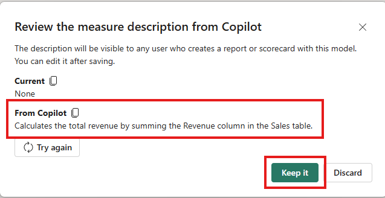
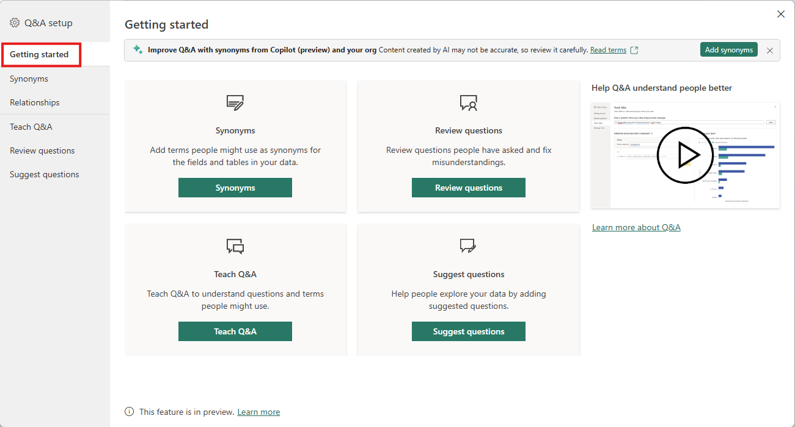
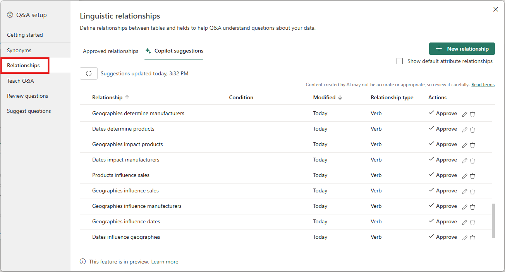

# Session 3 – Power BI & Copilot: The AI‑Enhanced Analyst (60 min)

## Session Overview

In this session, you will optimize a semantic model and use Copilot to enhance your analytics experience in Power BI. By the end, you’ll be able to improve model usability, configure Q&A, and apply best practices for AI-powered analytics.

---

## Step-by-Step Instructions

1. **Open the Semantic Model**  
   Download the provided content ([Download here](../downloads/Power BI.zip)) and open the **Copilot in Fabric** Power BI Desktop file.

    

2. **Copy the Lakehouse SQL Analytics Endpoint**  
   In your Lakehouse, click the ellipsis next to the SQL Analytics endpoint and select **Copy connection string**.

    

3. **Edit Parameters in Power BI Desktop**  
   In Power BI Desktop, go to **Edit Parameters**. Paste the connection string into the **server** parameter.  
   > *Tip: If your Lakehouse is named differently than `lh_demo`, update the database parameter accordingly. Click **OK** and then **Apply changes**.*

    
    

4. **Add Descriptions to Measures**  
   In **Model view** (Power BI Desktop or Service), add clear descriptions to your measures to improve model usability.

    
    

5. **Configure Q&A Synonyms**  
   Open **Q&A Tooling** (gear icon) and go to the **Synonyms** tab. Add 3–5 business synonyms for each key field (e.g., add "revenue" as a synonym for *Sales Amount*).

    
    
      
    [🔗 Q&A Best Practices (Microsoft Docs)](https://learn.microsoft.com/en-us/power-bi/natural-language/q-and-a-best-practices)

6. **Clean Up Field Names**  
   Hide key columns and rename any cryptic columns to friendly business names (e.g., rename `ProductID` to **Product ID**).

7. **Checkpoint: Review Your Model**  
   Verify that all tables are related, names are readable, and no errors appear in the model.  
   > *Discuss with your group: Does your model meet best practices?*

8. **Publish the Updated Model**  
   Save and publish the updated model back to your workspace.  
   *Optional: Compare your model to the **Copilot in Fabric – Clean** model included in the downloaded content.*

9. **Practice Prompts**  
   Re-run the following prompts from Session 2 and compare the visuals and answers. You should see improved results.  
   *Copy each prompt using the copy button:*

    ```text
    Show total sales by product category.
    ```

    ```text
    Create year-over-year sales growth measure. Explain the DAX.
    ```

    ```text
    Create an executive dashboard showing total sales, profit %, and top 5 products.
    ```

    ```text
    Summarize this page in three bullet points.
    ```

10. **Best Practices Reflection**  
    With your table-mates, compile a checklist of best practices: clear names, synonyms, star schema, and realistic expectations for Copilot.

---

## Tips for Success

- **Ask questions!** If you get stuck, raise your hand or ask a neighbor.
- **Pause at checkpoints** to review your progress.
- **Share your screen** if you need help troubleshooting.
- **Collaborate** with your group for the reflection activity.

---

Let your instructor know if you need further assistance or clarification!
